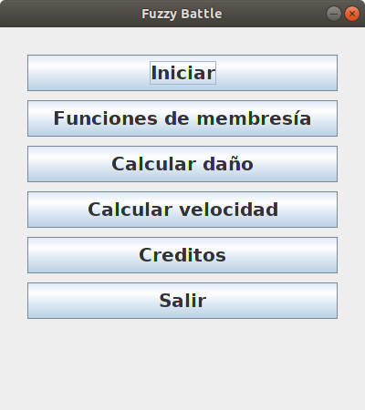
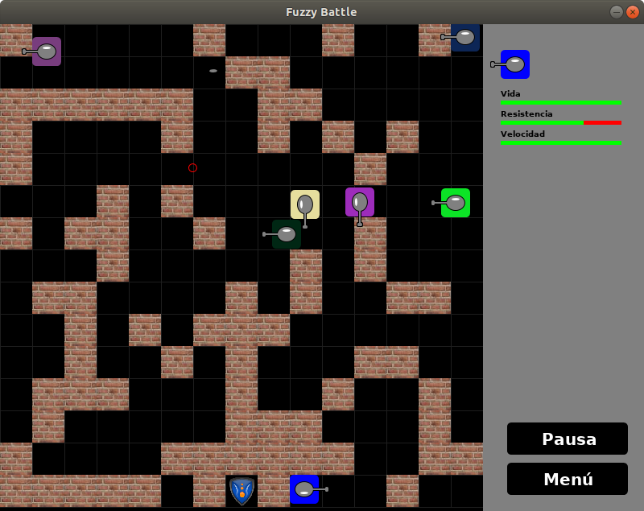

FuzzyBattle
===========

Descripción
-----------
Fuzzy Battle, es un juego 2D muy sencillo, inspirado en el juego
Battle City desarrollado por NAMCO. El objetivo del juego es destruir
los tanques enemigos, se emplea la Lógica Difusa propuesta por Lofti Zadeh
para establecer el daño que causan los proyectiles sobre los tanques.
La librería para los cálculos difusos es jFuzzyLogic
http://jfuzzylogic.sourceforge.net.

- Copyright: 2014 Saúl Piña <sauljabin@gmail.com>
- Repository: https://github.com/sauljabin/fuzzy-battle
- License: MIT
- Language: Java

Comandos
--------

```
make run

make clean

make download-lib
```

Screenshots
------------



